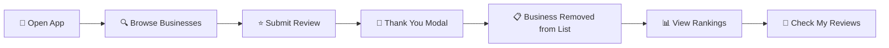

<div align="center">

# 🍋 Squeeze

### *Revolutionizing Local Business Reviews on Lemon Cash*

[](https://hackathon.example.com)
[](https://lemoncash.io)
[](https://nextjs.org)

[🚀 Live Demo](#) • [📖 Documentation](#features) • [💡 For Investors](#business-value)

---

</div>

## 🌟 What is Squeeze?

**Squeeze** is a next-generation business review platform built as a **Lemon Cash Mini App** for the *Ethereum Argentina Hackathon Tierra de Buidlers 2025*. We're transforming how users discover, review, and interact with local businesses through blockchain-powered transparency and incentivized engagement.

### ✨ The Vision

> *"Empowering communities to make informed decisions through transparent, verified reviews backed by blockchain technology."*

---

## 🎯 For Users

### Key Features

<table>
<tr>
<td width="33%">

#### 🔍 **Discover**
Browse verified businesses in your area with real-time ratings and authentic reviews.

</td>
<td width="33%">

#### 📊 **Rankings**
View comprehensive business rankings based on community feedback and ratings.

</td>
<td width="33%">

#### 💬 **Review**
Share your experiences and help others make better decisions with verified reviews.

</td>
</tr>
</table>

### User Journey



### Why Squeeze?

- ✅ **Verified Businesses**: Only trusted, verified businesses
- 🎯 **Curated Recommendations**: See businesses you haven't reviewed yet
- 📈 **Transparent Rankings**: Community-driven business ratings
- 🔒 **Secure**: Reviews backed by blockchain identity
- 🎨 **Beautiful Design**: Premium yellow/lemon theme

---

## 💼 Business Value

### For Investors

#### Market Opportunity

| Metric | Value |
|--------|-------|
| **Target Market** | Latin American crypto users (50M+) |
| **Platform** | Lemon Cash ecosystem |
| **Revenue Model** | Promoted listings, business verification, analytics |
| **Competitive Edge** | Blockchain-verified reviews, crypto-native audience |

#### Key Differentiators

1. **🔐 Blockchain Trust Layer**
   - Reviews tied to verified wallet addresses
   - Immutable review history
   - Prevents fake reviews and manipulation

2. **💰 Integrated Payment Flow**
   - Seamless crypto payments via Lemon Cash
   - Review prompts after successful transactions
   - Higher review conversion rates

3. **📊 Network Effects**
   - Each review strengthens the platform
   - Businesses incentivized to join for visibility
   - Users return for community-curated recommendations

4. **🎯 Monetization Pathways**
   - Premium business listings (verified badges)
   - Sponsored rankings
   - Business analytics dashboards
   - API access for third-party integration

#### Traction & Metrics

- ✅ **Hackathon Project**: Built for Ethereum Argentina 2025
- 🔥 **Tech Stack**: Production-ready Next.js 19 + Firebase
- 🎨 **UX**: Premium design with loading states, animations
- 📱 **Mobile-First**: Optimized for Lemon Cash mini-app platform

---

## 👨‍💻 For Developers

### Tech Stack

```
Frontend     │ Next.js 16 (App Router) + React 19
Styling      │ Tailwind CSS v4 + OKLCH Color System
Database     │ Firebase Realtime Database
Auth         │ Lemon Cash Mini App SDK
UI Library   │ Radix UI + shadcn/ui
Icons        │ Lucide React
```

### Architecture

```
┌─────────────────────────────────────────────────────┐
│                   Next.js App Router                │
├─────────────────────────────────────────────────────┤
│  Components Layer                                    │
│  ├─ BusinessList (Discover)                         │
│  ├─ BusinessRankings (All businesses with ratings)  │
│  ├─ MyReviews (User's review history)               │
│  ├─ RatingScreen (Review submission)                │
│  └─ PaymentInterface (Lemon Cash integration)       │
├─────────────────────────────────────────────────────┤
│  Services Layer                                      │
│  ├─ business-service.ts (Business data)             │
│  ├─ ledger.ts (Reviews & transactions)              │
│  └─ firebase.ts (Database connection)               │
├─────────────────────────────────────────────────────┤
│  Firebase Realtime Database                          │
│  /businesses/{id}                                    │
│    ├─ businessData                                  │
│    └─ /reviews/{reviewId}                           │
└─────────────────────────────────────────────────────┘
```

### Firebase Database Structure

```json
{
  "businesses": {
    "{businessId}": {
      "fiscalName": "Legal Business Name",
      "fantasyName": "Display Name",
      "description": "Business description",
      "category": "Food & Beverage",
      "verified": true,
      "location": {
        "lat": 40.758,
        "lng": -73.9855,
        "address": "123 Broadway, NY"
      },
      "reviews": {
        "{reviewId}": {
          "author": "0x...",
          "rating": 5,
          "comment": "Great experience!",
          "timestamp": "2025-01-20T15:30:00Z"
        }
      }
    }
  }
}
```

### Quick Start

#### Prerequisites

```bash
node >= 18.0.0
yarn >= 1.22.0
```

#### Installation

```bash
# Clone the repository
git clone https://github.com/yourusername/squeeze2025.git
cd squeeze2025

# Install dependencies
yarn install

# Set up environment variables
cp .env.example .env.local
# Add your Firebase credentials to .env.local

# Start development server
yarn dev
```

#### Environment Variables

```env
NEXT_PUBLIC_FIREBASE_API_KEY=your_api_key
NEXT_PUBLIC_FIREBASE_AUTH_DOMAIN=your_project.firebaseapp.com
NEXT_PUBLIC_FIREBASE_DATABASE_URL=https://your_project.firebaseio.com
NEXT_PUBLIC_FIREBASE_PROJECT_ID=your_project_id
NEXT_PUBLIC_FIREBASE_STORAGE_BUCKET=your_project.appspot.com
NEXT_PUBLIC_FIREBASE_MESSAGING_SENDER_ID=your_sender_id
NEXT_PUBLIC_FIREBASE_APP_ID=your_app_id
```

#### Firebase Setup

1. **Create Firebase Project**: Go to [Firebase Console](https://console.firebase.google.com)
2. **Enable Realtime Database**: Database → Create Database
3. **Set Rules** (Development):
   ```json
   {
     "rules": {
       ".read": true,
       ".write": true
     }
   }
   ```
4. **Seed Database**: Navigate to `/seed` and click "Seed Database"

### Development Commands

```bash
yarn dev          # Start development server
yarn build        # Build for production
yarn start        # Start production server
yarn lint         # Run ESLint
```

### Key Files

| File | Purpose |
|------|---------|
| `app/page.tsx` | Main app entry point with screen routing |
| `components/business-rankings.tsx` | All business rankings with Firebase data |
| `components/my-reviews.tsx` | User's submitted reviews |
| `lib/firebase.ts` | Firebase initialization |
| `lib/business-service.ts` | Business data fetching |
| `lib/ledger.ts` | Review submission to Firebase |

### API Integration

#### Lemon Cash Mini App SDK

```typescript
import { authenticate, isWebView } from "@lemoncash/mini-app-sdk"

// Authenticate user
const result = await authenticate({ chainId: ChainId.BASE })
const wallet = result.data.wallet // User's wallet address
```

#### Firebase Realtime Database

```typescript
import { ref, get, push } from "firebase/database"
import { db } from "@/lib/firebase"

// Fetch businesses
const snapshot = await get(ref(db, "businesses"))
const businesses = snapshot.val()

// Submit review
const reviewRef = ref(db, `businesses/${businessId}/reviews`)
await push(reviewRef, { rating, comment, author, timestamp })
```

### Design System

#### Colors (OKLCH)

```css
/* Yellow/Lemon Theme */
--primary: oklch(0.85 0.18 95)     /* Vibrant lemon yellow */
--secondary: oklch(0.75 0.16 85)    /* Golden yellow */
--accent: oklch(0.9 0.15 90)        /* Bright yellow accent */

/* Custom Gradients */
.bg-lemon-gradient           /* Subtle background */
.bg-lemon-gradient-vibrant   /* Vibrant elements */
.bg-lemon-mesh              /* Hero backgrounds */
```

#### Components

- All components use shadcn/ui base
- Custom yellow theme overrides
- Responsive design with `sm:`, `md:`, `lg:` breakpoints
- Loading states with spinners
- Empty states with helpful messages

---

## 🎨 Features & Screenshots

### 1️⃣ Business Discovery

**Hide reviewed businesses** to keep your feed fresh with new experiences.

- Yellow checkmark badges for verified/promoted businesses
- Star ratings with visual feedback
- Category tags and location info
- Search functionality

### 2️⃣ Review Submission

**Premium UX** with loading states and success modals.

- 5-star rating system with hover effects
- Optional comment field
- Loading spinner during submission
- Thank you modal with smooth transitions
- Business automatically removed from discover list

### 3️⃣ Business Rankings

**Complete transparency** - see all businesses ranked by community ratings.

- Top 3 get special badge colors (gold, silver, bronze)
- Average rating + review count
- Sorted by rating (best first)
- Click to view business details

### 4️⃣ My Reviews

**Track your contribution** to the community.

- Chronological list of your reviews
- Business name, rating, and comments
- Timestamps for each review
- Click to revisit businesses

---

## 🚀 Deployment

### Vercel (Recommended)

```bash
# Install Vercel CLI
npm i -g vercel

# Deploy
vercel
```

### Environment Variables

Add all `NEXT_PUBLIC_FIREBASE_*` variables in Vercel Dashboard → Settings → Environment Variables

### Firebase Security Rules

For production, update rules:

```json
{
  "rules": {
    ".read": true,
    "businesses": {
      "$businessId": {
        "reviews": {
          ".write": "auth != null"
        }
      }
    }
  }
}
```

---

## 📊 Performance

- ⚡ **Fast Load Times**: Next.js 16 with Turbopack
- 📱 **Mobile Optimized**: Responsive design
- 🎯 **SEO Ready**: Server-side rendering
- 🔄 **Real-time Updates**: Firebase Realtime Database
- ⚙️ **Optimistic UI**: Instant feedback on actions

---

## 🛣️ Roadmap

### Phase 1: MVP ✅
- [x] Business discovery and review
- [x] Firebase integration
- [x] Rankings and user review history
- [x] Yellow/lemon theme

### Phase 2: Enhanced Features
- [ ] Edit/delete reviews
- [ ] Review photos
- [ ] Business claims and verification
- [ ] Review moderation system
- [ ] Push notifications

### Phase 3: Monetization
- [ ] Premium business listings
- [ ] Promoted rankings
- [ ] Business analytics dashboard
- [ ] API for third-party integration

### Phase 4: Scale
- [ ] Multi-region support
- [ ] AI-powered recommendations
- [ ] Gamification and rewards
- [ ] Integration with more Lemon Cash features

---

## 👥 Contributing

We welcome contributions! Please see our [Contributing Guide](CONTRIBUTING.md) for details.

```bash
# Fork the repo
# Create a feature branch
git checkout -b feature/amazing-feature

# Commit your changes
git commit -m 'Add amazing feature'

# Push to the branch
git push origin feature/amazing-feature

# Open a Pull Request
```

---

## 📄 License

This project is licensed under the MIT License - see the [LICENSE](LICENSE) file for details.

---

## 🙏 Acknowledgments

- **Ethereum Argentina** - For organizing the Tierra de Buidlers Hackathon 2025
- **Lemon Cash** - For the amazing Mini App SDK and platform
- **shadcn/ui** - For beautiful, accessible components
- **Vercel** - For Next.js and hosting platform

---

## 📞 Contact

**Project Maintainer**: [Your Name]

- 🐦 Twitter: [@yourhandle](https://twitter.com/yourhandle)
- 💼 LinkedIn: [Your Profile](https://linkedin.com/in/yourprofile)
- 📧 Email: your.email@example.com

**Project Link**: [https://github.com/yourusername/squeeze2025](https://github.com/yourusername/squeeze2025)

---

<div align="center">

### ⭐ Star this repo if you find it useful!

**Built with 🍋 for the Ethereum Argentina Hackathon 2025**

[🔝 Back to Top](#-squeeze)

</div>
